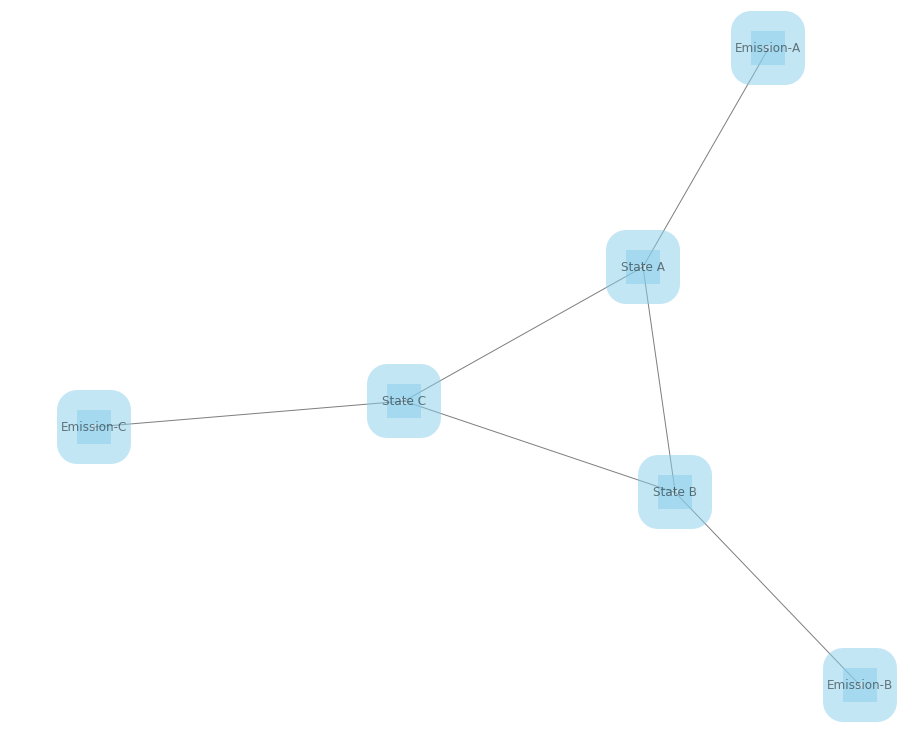
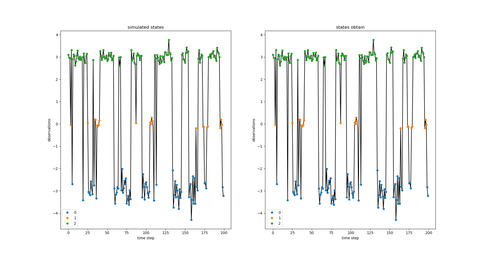

# Hidden Markov Model
This is a first implementation of Hidden Markov Model. The implementation uses Expectation Maximization to find the transition matrix, emission parameters and the states distributions. The model is made of the hidden states with transitions probabilities between each states and emission probabilities that are modeled using the Gaussian distribution.



 The emission create the observations which are the only information that we have. The implementation use the [forward-backward](https://en.wikipedia.org/wiki/Forward%E2%80%93backward_algorithm) algorithm. There is still issues with the implementation (see know issues).

Here is some results on a toy dataset. 



Only the Gaussian emission is implemented.

# Anaconda environment

````
conda env create --file requirement.yml
````

# Examples

Script for the examples are in the folder examples.

# Tests

To run the tests

````
pytest -v tests/
````

# To do

- vectorize the for-loops 
- Documentation for equations [Rabiner 1989](https://www.ece.ucsb.edu/Faculty/Rabiner/ece259/Reprints/tutorial%20on%20hmm%20and%20applications.pdf)
- More tests for good coverage
- Objects: model parameter G-HMM and training parameters (for cleaner code)
- verification if there is underflow in probabilities
- implement metrics

# Known issues
- Numerical instability in transition matrix for low visited states

- High sensibility to initial states calculated

- Does not penalize enough for high variance (might confuse two states for this reason)

  

